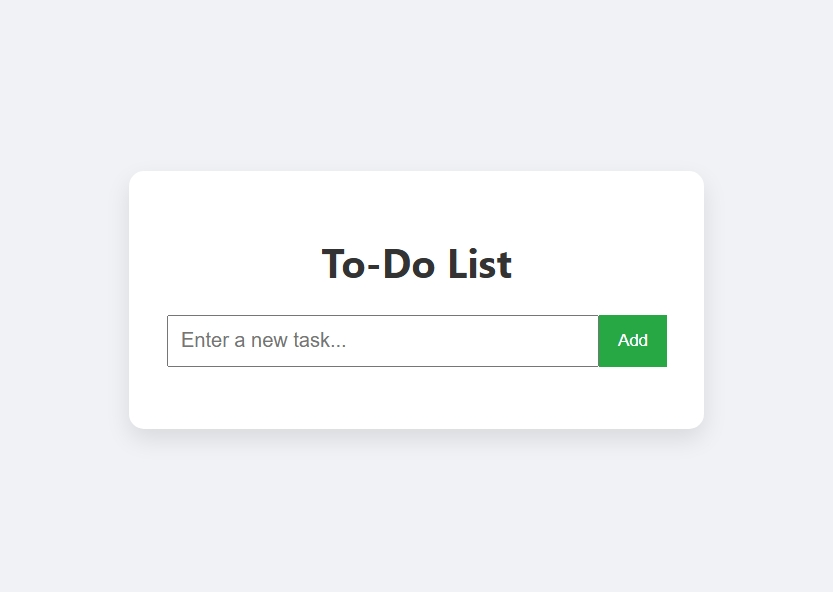

# 📝 Task 2 – To-Do List Web App (Front-End Only)

### 🚀 Submitted for: Elevate-Labs Internship

---

### 📌 Objective

Build a dynamic **To-Do List Web Application** using **Vanilla JavaScript**, **HTML**, and **CSS**. The app allows users to:
- ✅ Add new tasks
- ✅ Mark tasks as complete
- ✅ Delete tasks

No frameworks or libraries were used — just pure HTML, CSS, and JavaScript.

---

### 📂 Project Structure

```
todo-app/
│
├── index.html       # HTML markup
├── style.css        # Stylesheet for UI design
└── script.js        # JavaScript for app functionality
```

---

### 📸 Preview



---

### 🛠️ Tools Used

- **Visual Studio Code** (Code Editor)
- **Live Server** Extension (Development server)
- **Chrome Browser** (Testing)
- **Vanilla JavaScript**, **HTML5**, **CSS3**

---

### 💡 Features

- ➕ Add a new task
- ✅ Mark a task as completed (with strikethrough effect)
- ❌ Delete a task
- ✨ Simple and responsive UI

---

### 🧪 How to Run

1. Clone or download this repository.
2. Open the project folder in **VS Code**.
3. Open `index.html` with **Live Server** (right-click → *Open with Live Server*).
4. Start using the app: add, mark complete, or delete tasks.

---

### 🔧 Future Enhancements (Optional Ideas)
- Persist tasks using `localStorage`
- Add filters: **All / Active / Completed**
- Add due dates or priority levels
- Drag-and-drop task sorting

---

### 👨‍💻 Developed By

**Ayush Kumar**  
*Elevate-Labs Internship Candidate*
